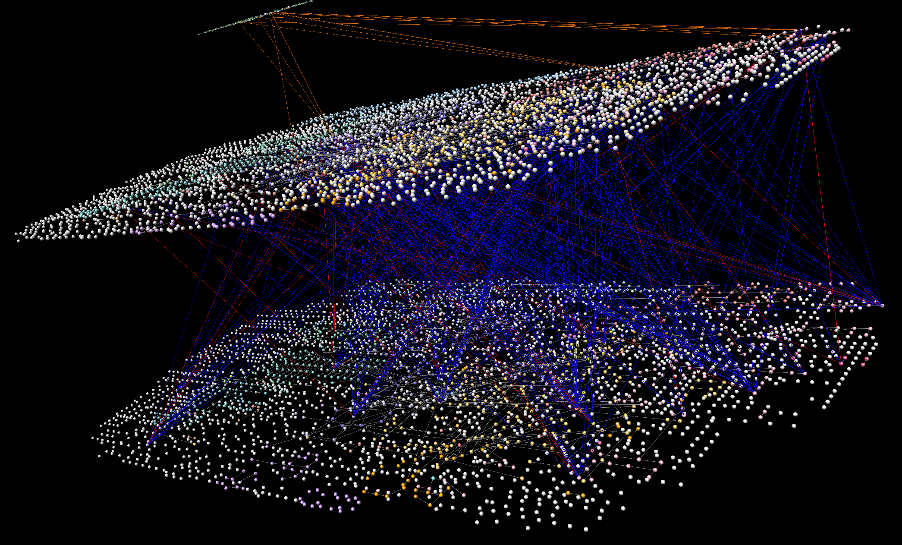

# transomics2cytoscape

[](https://doi.org/10.5281/zenodo.8201898)

[](http://bioconductor.org/checkResults/release/bioc-LATEST/transomics2cytoscape/) - Bioconductor Release Build

[](http://bioconductor.org/checkResults/devel/bioc-LATEST/transomics2cytoscape/) - Bioconductor Dev Build

## Introduction

Visualization of trans-omic networks helps biological interpretation by
illustrating pathways where the signals are transmitted.

To characterize signals that go across multiple omic layers, [Yugi and
colleagues have proposed a method for network visualization](https://pubmed.ncbi.nlm.nih.gov/25131207/)
by stacking multiple 2D pathways in a 3D space.

The 3D network visualization was realized by [VANTED](https://www.cls.uni-konstanz.de/software/vanted/).
However, the visualization relies on time-consuming manual operation.
Here we propose **transomics2cytoscape**, an R package that automatically creates
3D network visualization in combination with
Cytoscape, [Cy3D App](http://apps.cytoscape.org/apps/cy3d), and
[Cytoscape Automation](https://genomebiology.biomedcentral.com/articles/10.1186/s13059-019-1758-4).

## Installation

1. Install Cytoscape from https://cytoscape.org/
2. Install transomics2cytoscape (see https://www.bioconductor.org/packages/release/bioc/html/transomics2cytoscape.html)

## Example

1. Run Cytoscape (If Cytoscape is already running, you don't need to run it anymore. transomics2cytoscape works only when 1 Cytoscape [window] is up.)
2. Run R.
3. Run the following R code. This will import multiple networks and integrate the networks to a 3D space. (This will take a few minutes.)

```R
library(transomics2cytoscape)
networkDataDir <- tempfile(); dir.create(networkDataDir)
networkLayers <- system.file("extdata/usecase1", "yugi2014.tsv",
                            package = "transomics2cytoscape")
stylexml <- system.file("extdata/usecase1", "yugi2014.xml",
                            package = "transomics2cytoscape")
suid <- create3Dnetwork(networkDataDir, networkLayers, stylexml)
```

Next Run the following R code. This will add edges between the network layers. (This code execution finishes faster than before.)

```
layer1to2 <- system.file("extdata/usecase1", "k2e.tsv",
                            package = "transomics2cytoscape")
suid <- createTransomicEdges(suid, layer1to2)
layer2to3 <- system.file("extdata/usecase1", "allosteric_ec2rea.tsv", package = "transomics2cytoscape")
suid <- createTransomicEdges(suid, layer2to3)
```

Then, you should have a 3D view with layered networks and transomic
interactions between them.
(Note that you need to perform operations such as zooming out or adjusting the
camera angle.)


